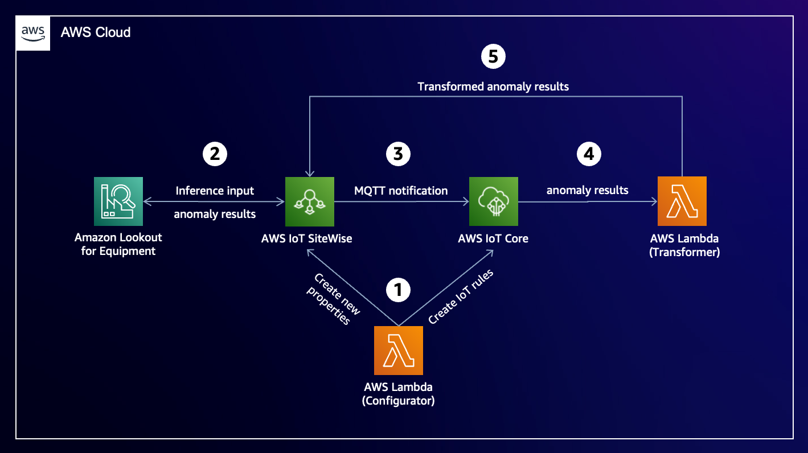
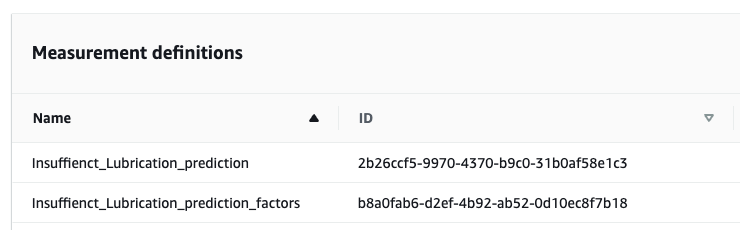
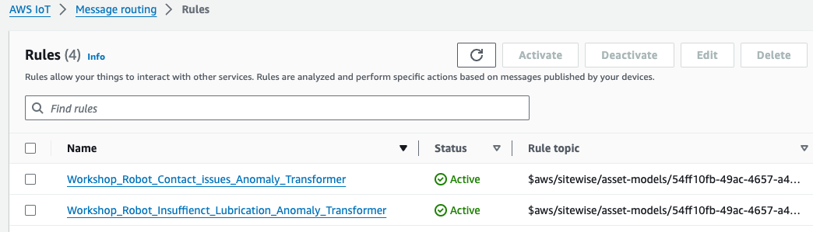
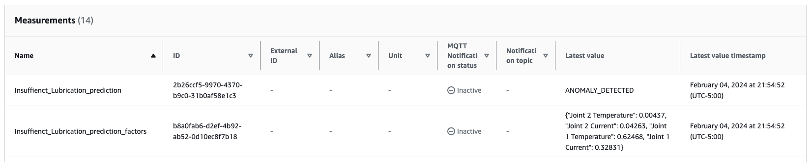

# Anomaly Results Transformation for AWS IoT SiteWise

## Table of contents
1. [About this Repo](#about-this-repo)
2. [How does it work?](#how-does-it-work)
3. [How to use?](#how-to-use)
    1. [Prepare Lambda layer](#1-prepare-lambda-layer)
    2. [Create a CloudFormation stack](#2-create-a-cloudformation-stack)
    3. [Review the resources created](#3-review-the-resources-created)
    4. [Verify the converted results](#4-verify-the-converted-results)
4. [Cost](#cost)
5. [Clean up](#clean-up)

## About this Repo
With the [recent integration](https://aws.amazon.com/about-aws/whats-new/2023/11/aws-iot-sitewise-multi-variate-anomaly-detection-amazon-lookout-equipment/) between **AWS IoT SiteWise** and **Amazon Lookout for Equipment**, customers can now enable multi-variate anomaly detection models for industrial assets. 

AWS IoT SiteWise supplies inference input data to Amazon Lookout for Equipment and writes back the anomaly results from Amazon Lookout for Equipment into the `AWS/L4E_ANOMALY_RESULT` property. This property contains raw anomaly results and requires client applications to convert them into a human-readable format.

For clients that do not support this conversion, this repository provides a solution by converting raw anomaly results into a human-readable format and storing them in AWS IoT SiteWise. Consequently, clients can directly access the converted results without needing any client-side logic.

## How does it work?
An AWS CloudFormation template is provided in the repository that creates almost all the required resources for you. The control and data flow are explained below.



1. An AWS Lambda function creates new properties to store converted anomaly results, enables MQTT notifications for these properties, and finally creates IoT rules to forward the data to another Lambda function.
2. AWS IoT SiteWise collects raw anomaly results from Amazon Lookout for Equipment and stores them in the `AWS/L4E_ANOMALY_RESULT` property.
3. Whenever new anomaly results are available, AWS IoT SiteWise forwards them as MQTT messages to AWS IoT Core.
4. AWS IoT Core triggers a Lambda function
5. This Lambda function converts the raw anomaly results and writes the converted results into properties ending with `_prediction` and `_prediction_factors`.

**Example**:
|Property | Value |
|----|----|
|`AWS/L4E_ANOMALY_RESULT` | ```{\"timestamp\":\"2024-02-05T01:58:42.000000\",\"prediction\":1,\"prediction_reason\":\"ANOMALY_DETECTED\",\"anomaly_score\":1.0,\"diagnostics\":[{\"name\":\"6db539ef-424a-435c-87b8-524a22af8776\\\\6db539ef-424a-435c-87b8-524a22af8776\",\"value\":0.01899},{\"name\":\"1d257b80-287c-45a7-a4ff-32f646d3bbad\\\\1d257b80-287c-45a7-a4ff-32f646d3bbad\",\"value\":0.03006},{\"name\":\"9c45a9e2-362b-4903-82b1-f94dc76303ab\\\\9c45a9e2-362b-4903-82b1-f94dc76303ab\",\"value\":0.63539},{\"name\":\"0448f2bc-178b-47f5-9376-187067132e3a\\\\0448f2bc-178b-47f5-9376-187067132e3a\",\"value\":0.31556}]}```
|ending with `_prediction` | `ANOMALY_DETECTED`
|ending with `_prediction_factors` | `{"Joint 2 Temperature": 0.08481, "Joint 2 Current": 0.0609, "Joint 1 Temperature": 0.56514, "Joint 1 Current": 0.28916}`

## How to use?
### 1) Prepare Lambda layer

The default Python SDK version provided in AWS Lambda does not yet support some of the recently launched AWS IoT SiteWise features. To address this, you will add to add a Lambda layer that includes a supported Python SDK version.

1. From your terminal, install Boto3 1.34.34 or higher locally.
`pip3 install -t ./python boto3==1.34.34`

2. Zip the `python` folder
`zip -r boto3-1.34.34.zip python`

3. Upload the `boto3-1.34.34.zip` file to an Amazon S3 bucket. 

This file will later be used by the CloudFormation template to create a Lambda layer.

### 2) Create a CloudFormation stack

Use the [sitewise-anomaly-results-transformation.yaml](assets/cfn/sitewise-anomaly-results-transformation.yaml) and create a new CloudFormation stack.
1. Navigate to [AWS CloudFormation console](https://console.aws.amazon.com/cloudformation/home)
2. Choose **Create stack** &rarr; **Upload a template file** &rarr; **Choose file**
3. Locate the `.yaml` template and choose **Next**
4. Provide the **stack name** as `SiteWiseAnomalyTransformation`
5. Provide the parameters
    * **S3BucketName**: Name of the bucket where the `.zip` file was uploaded
    * **S3Key**: Key name for the uploaded `.zip` file
    * **AssetModelIDs**: [Optional] Comma demilited list of asset model IDs or leave empty
6. Choose **Next** and leave the default settings
7. Choose **Next** and review the configuration
8. Check `I acknowledge xx` and choose **Submit**

Creating the stack may take a few minutes. Please wait until the status changes to `CREATE_COMPLETE`.

### 3) Review the resources created

You will notice that for each prediction definition in the asset model a set of two properties and an IoT rule are created.

Verify the properties at [AWS IoT SiteWise console](https://console.aws.amazon.com/iotsitewise/home) &rarr; **Build** &rarr; **Models** &rarr; **\<Model>** &rarr; **Properties** &rarr; **Measurements**.



Verify the IoT rules at [AWS IoT Core console](https://console.aws.amazon.com/iot/home) &rarr; **Manage** &rarr; **Message routing** &rarr; **Rules**.



### 4) Verify the converted results
Wait for the next scheduled inference run, and verify the converted anomaly results at **AWS IoT SiteWise console** &rarr; **Build** &rarr; **Assets** &rarr; **\<Asset>** &rarr; **Properties** &rarr; **Measurements** &rarr; **Latest value**.



## Cost
You will incur costs for the resources deployed in this solution. For more details about pricing, refer to [AWS Pricing](https://aws.amazon.com/pricing).

## Clean up
If you no longer require the solution, ensure you remove the resource to avoid incurring costs.

1. Delete the CloudFormation stack
2. Delete the new properties added to the SiteWise asset models
3. Delete the new IoT rules created